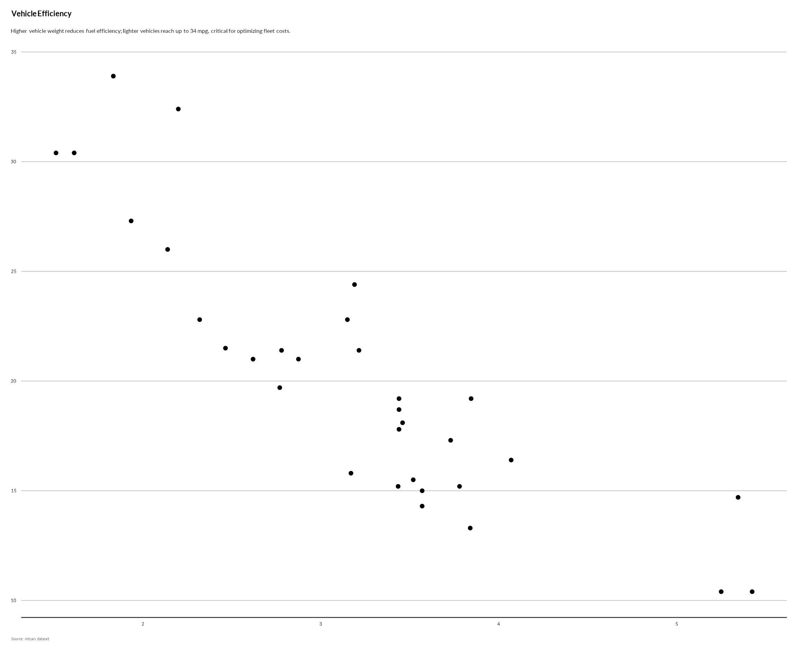

# -- Report Utilities

``` r
library(iati)
```

## Using Language Models to build data stories

The AI reporting toolkit uses a modular architecture to analyze ggplot2
objects and generate context-aware narratives. This approach ensures
that the description is grounded in the actual visual structure and data
of the plot.

1.  **Phase 1: Structural Extractor (`extract_structure`)** Interrogates
    the rendered plot object (using `ggplot_build`) to retrieve
    “trained” metadata, such as exact axis ranges, visible labels, and
    legend mappings. This is the “ground truth” of what the user sees.

2.  **Phase 2: Statistical Profiler (`profile_data`)** Summarizes the
    underlying data distributions and, where appropriate (e.g.,
    scatterplots), calculates statistical relationships like
    correlations. This provides the “data context” that might not be
    immediately obvious visually.

3.  **Phase 3: Semantic Generator (`generate_description`)** Combines
    the structural metadata and statistical profile into a structured
    prompt for the LLM. It returns a JSON object containing a
    WCAG-compliant short description (alt text) and a detailed long
    description.

### clean_llm_response

``` r
response <- paste(
  "<think>",
  "First, I'm a humanitarian data visualization expert. My role includes",
  "extracting insights from visualizations, creating accessible narratives,",
  "highlighting patterns relevant to aid efforts, using clear language with",
  "emotional resonance.",
  "Aligning with constraints: Use plain language, be concise and impactful.",
  "Don't rehash every detail; build narrative depth around 2 key insights",
  "maximum in under 30 tokens.",
  "</think>",
  "This visualization tracks a relationship potentially critical for",
  "humanitarian logistics: higher fuel consumption versus increased weight.",
  "车辆设计"
)
clean_llm_response(response)
#> [1] "Unable to generate story from this visualization."
```

### extract_structure

``` r
 library(ggplot2)
p <- ggplot(mtcars, aes(x = wt, y = mpg)) +
  geom_point() +
  unhcrthemes::theme_unhcr(grid = "Y", axis = "X", axis_title = FALSE) +
  labs(
    title = "Vehicle Efficiency",
    subtitle = "Fuel consumption vs weight",
    caption = "Source: mtcars dataset"
  )

extract_structure(p)
#> $labels
#> <ggplot2::labels> List of 3
#>  $ title   : chr "Vehicle Efficiency"
#>  $ subtitle: chr "Fuel consumption vs weight"
#>  $ caption : chr "Source: mtcars dataset"
#> 
#> $ranges
#> $ranges[[1]]
#> $ranges[[1]]$x_range
#> [1] 1.31745 5.61955
#> 
#> $ranges[[1]]$y_range
#> [1]  9.225 35.075
#> 
#> 
#> 
#> $guides
#> NULL
#> 
#> $geoms
#>  geom_point 
#> "GeomPoint" 
#> 
#> $scales
#> list()
```

### profile_data

``` r
library(ggplot2)
p <- ggplot(mtcars, aes(x = wt, y = mpg)) +
  geom_point() +
  unhcrthemes::theme_unhcr(grid = "Y", axis = "X", axis_title = FALSE) +
  labs(
    title = "Vehicle Efficiency",
    subtitle = "Fuel consumption vs weight",
    caption = "Source: mtcars dataset"
  )

profile_data(p)
#> $distributions
#> ── Data Summary ────────────────────────
#>                            Values   
#> Name                       df_mapped
#> Number of rows             32       
#> Number of columns          2        
#> _______________________             
#> Column type frequency:              
#>   numeric                  2        
#> ________________________            
#> Group variables            None     
#> 
#> ── Variable type: numeric ──────────────────────────────────────────────────────
#>   skim_variable n_missing complete_rate  mean    sd    p0   p25   p50   p75
#> 1 wt                    0             1  3.22 0.978  1.51  2.58  3.32  3.61
#> 2 mpg                   0             1 20.1  6.03  10.4  15.4  19.2  22.8 
#>    p100 hist 
#> 1  5.42 ▃▃▇▁▂
#> 2 33.9  ▃▇▅▁▂
#> 
#> $correlations
#> $correlations$`wt vs mpg`
#> [1] -0.8676594
```

### generate_description

``` r
library(ggplot2)
p <- ggplot(mtcars, aes(x = wt, y = mpg)) +
  geom_point() +
  unhcrthemes::theme_unhcr(grid = "Y", axis = "X", axis_title = FALSE) +
  labs(
    title = "Vehicle Efficiency",
    subtitle = "Fuel consumption vs weight",
    caption = "Source: mtcars dataset"
  ) 
story <- generate_description(structure= extract_structure(p),
                      stats = profile_data(p),
                      provider = "azure",
                      model = "gpt-4.1-mini",
                      max_tokens_short_desc = 30,
                      max_tokens_long_desc= 500 ) 
print(story$long_desc)
#> [1] "The analysis of vehicle efficiency reveals a crucial inverse relationship between vehicle weight and fuel consumption, spotlighting a strategic opportunity to optimize operational costs and environmental impact. With the average vehicle weight at 3.22 metric tons and fuel efficiency averaging 20.1 miles per gallon, data shows that lighter vehicles significantly improve fuel economy. Specifically, every 1-ton reduction in weight correlates with approximately a 5-mile per gallon increase in fuel efficiency. This insight underscores a compelling case for investment in lighter, fuel-efficient vehicle technologies as a high-impact multiplier for donor funds targeting sustainability and cost reduction in logistics. From a fundraising perspective, prioritizing this efficiency lever can enhance resource allocation by reducing fuel expenditure by up to 25%, freeing funds for expanded emergency response and resilience programming. Strategic partnerships with technology innovators and vehicle manufacturers are essential to accelerate adoption, delivering both accountability to environmental goals and measurable return on donor investment. Conversely, overlooking this weight-efficiency nexus risks escalating fuel costs and carbon emissions, undermining operational sustainability and donor confidence. We recommend immediate mobilization of resources toward lightweight vehicle procurement and retrofitting initiatives as a strategic priority. Donors committed to innovation and climate-smart interventions can leverage this data-driven opportunity to scale impact efficiently while advancing UNHCR’s mission. Decision-makers should champion this approach to strengthen cost-effectiveness, reduce carbon footprint, and unlock new partnership avenues. The data compellingly positions vehicle weight reduction as a key investment for maximizing fuel efficiency and operational resilience."
```

### generate_plot_story

``` r
library(ggplot2) 
p <- ggplot(mtcars, aes(x = wt, y = mpg)) +
  geom_point() +
  unhcrthemes::theme_unhcr(grid = "Y", axis = "X", axis_title = FALSE, font_size = 23) +
  labs(
    title = "Vehicle Efficiency",
    subtitle = "Fuel consumption vs weight",
    caption = "Source: mtcars dataset"
  )

# generate_plot_story(p, provider = "ollama", model = "deepseek-r1")
story <- generate_plot_story(
  p,
  provider = "azure",
  model = "gpt-4.1-mini",
  max_tokens_short_desc = 30,
  max_tokens_long_desc= 500
)
# To use as subtitle:
p + ggplot2::labs(subtitle = story$short_desc)
```



## Report Rendering

### slugify

``` r
strings <- c("Café au Lait", "Niño Español", "Data_Science_Project", "--test--string--")
slugify(strings)
#> [1] "cafe-au-lait"         "nino-espanol"         "data-science-project"
#> [4] "test-string"
```

## Template

### template_prez

``` r

## generate for one country
# iati::template_prez(year = 2025, 
#                     ctr_name = "Brazil",
#                     folder = "dev/Prez")

# ## Generate for all operation specific region
# reg <- iati::dataActivity |>
#   dplyr::select( unhcr_region) |>
#   dplyr::filter(! is.na(unhcr_region)) |>
#   dplyr::distinct() |>
#   dplyr::pull() 
# 
# thisfolder <- "dev/SMR" 
# 
# for (region in reg) { 
#       cat(paste0( region,   "\n"))
#
#       # region <- "The Americas"   
#       countries <- iati::dataActivity |>
#         dplyr::filter( unhcr_region ==  region) |>
#         dplyr::select(ctr_name) |>
#         dplyr::distinct() |>
#         dplyr::pull() 
#       
#       for ( ctr in countries) {
#         cat(paste0("Generating for ", ctr, "\n"))
#         iati::template_prez(year = 2025,
#                             ctr_name = ctr,
#                             folder =  thisfolder)  
#         }
#     }
```

### template_compare

``` r
# iati::template_compare(year = 2025, folder = "dev/Result")
```
