# UNHCR Programme

``` r
library(iati)
#> Warning: replacing previous import 'cowplot::align_plots' by
#> 'patchwork::align_plots' when loading 'iati'
#> Warning: replacing previous import 'purrr::discard' by 'scales::discard' when
#> loading 'iati'
#> Warning: replacing previous import 'dplyr::lag' by 'stats::lag' when loading
#> 'iati'
#> Warning: replacing previous import 'dplyr::filter' by 'stats::filter' when
#> loading 'iati'
#> Warning: replacing previous import 'stats::filter' by 'dplyr::filter' when
#> loading 'iati'
```

## Using `iati::dataResult`

### show_indicators

- How much **indicators** relate to target or baseline - or acceptable
  global standard green threshold (for outcome indicators after 2022)- ?

``` r
show_indicators(year = 2022,  
             ctr_name = "Brazil",
             result_type_name = "Outcome",
             type = "deviation"
             )
```


``` r
show_indicators(year = 2022,  
             ctr_name = "Brazil",
             result_type_name = "Outcome",
             type = "progress"
             )
```

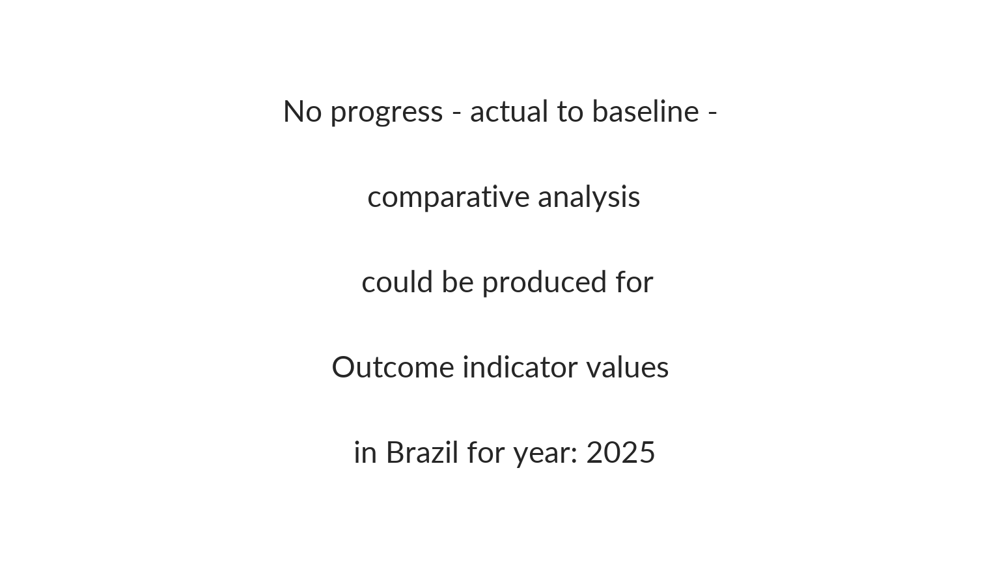

``` r
show_indicators(year = 2022,  
             ctr_name = "Brazil",
             result_type_name = "Outcome",
             type = "gap"
             )
```

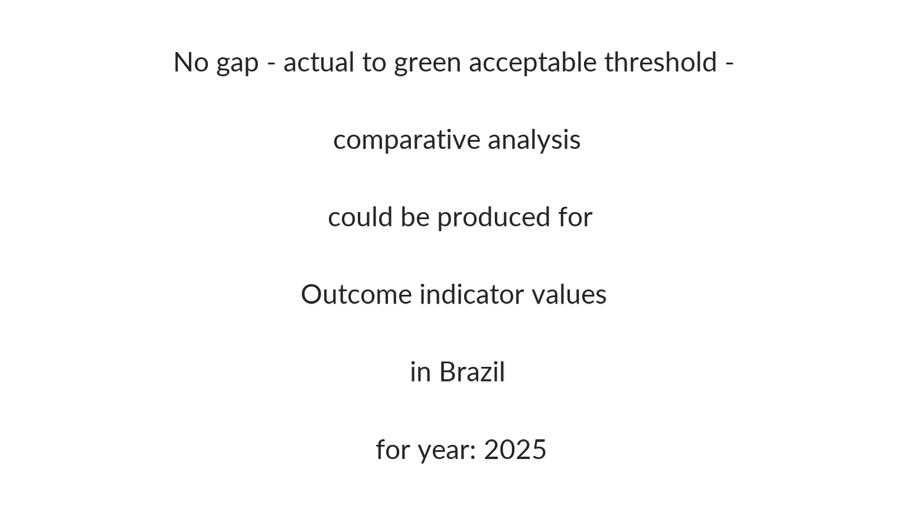

``` r
show_indicators(year = 2022,  
             ctr_name = "Brazil",
             result_type_name = "Impact",
             type = "deviation"
             )
```

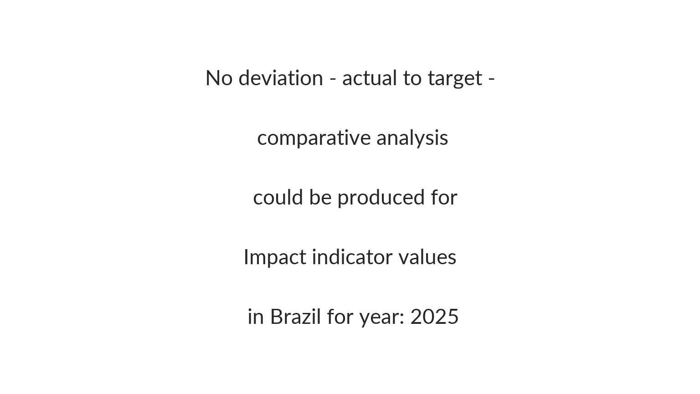

``` r
show_indicators(year = 2022,  
             ctr_name = "Brazil",
             result_type_name = "Impact",
             type = "progress"
             )
```


``` r
show_indicators(year = 2019,  
             ctr_name = "Brazil",
             result_type_name = "Output",
             type = "deviation"
             )
```

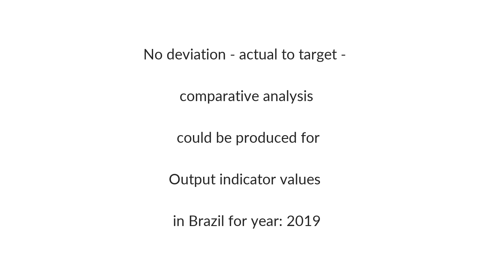

``` r
show_indicators(year = 2019,  
             ctr_name = "Brazil",
              result_type_name = "Output",
             type = "progress"
             )
```

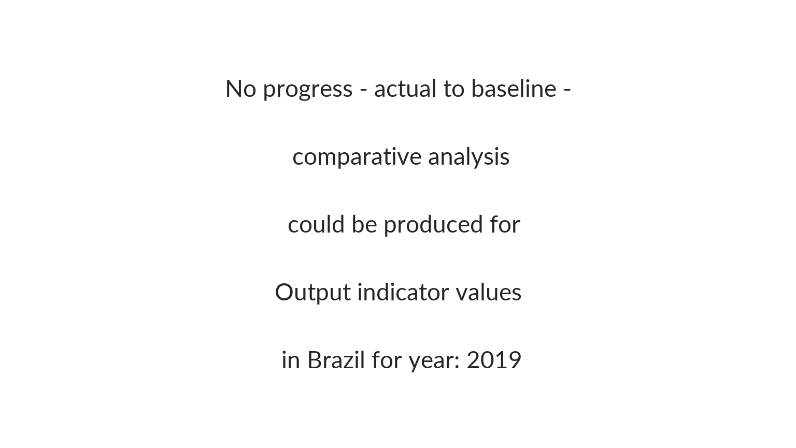

### show_indicators_time

``` r
show_indicators_time(year = 2020,  
             ctr_name = "Brazil",
              result_type_name = "Outcome",
             type = "deviation"
             )
```

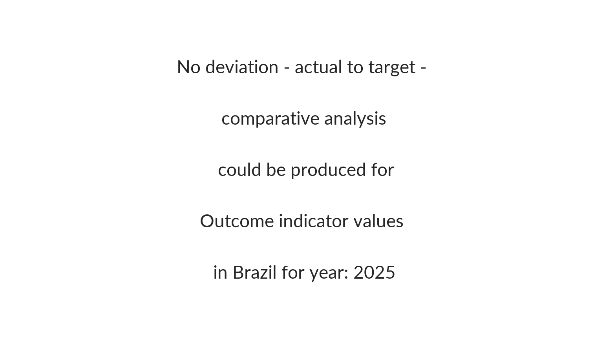

``` r
show_indicators_time(year =  2020, 
             ctr_name = "Brazil",
              result_type_name = "Outcome",
             type = "progress"
             )
```


``` r
show_indicators_time(year =  2020, 
             ctr_name = "Brazil",
              result_type_name = "Outcome",
             type = "gap"
             )
```

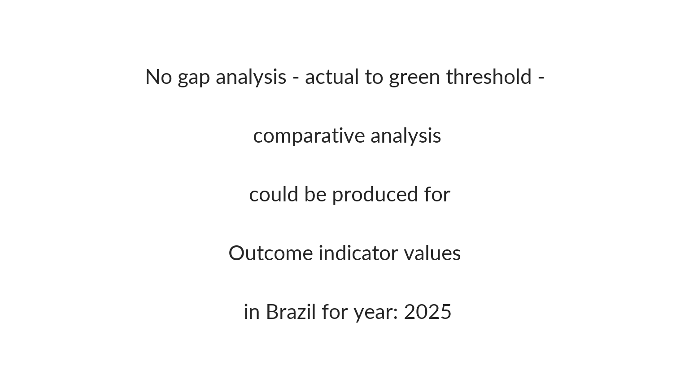

``` r
show_indicators_time(year =  2020, 
             ctr_name = "Brazil",
              result_type_name = "Impact",
             type = "deviation"
             )
```


``` r
show_indicators_time(year =  2020, 
             ctr_name = "Brazil",
              result_type_name = "Impact",
             type = "progress"
             )
```

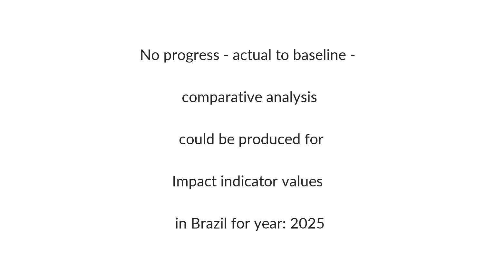

``` r
show_indicators_time(year =  2020,  
             ctr_name = "Brazil",
              result_type_name = "Output",
             type = "deviation"
             )
```

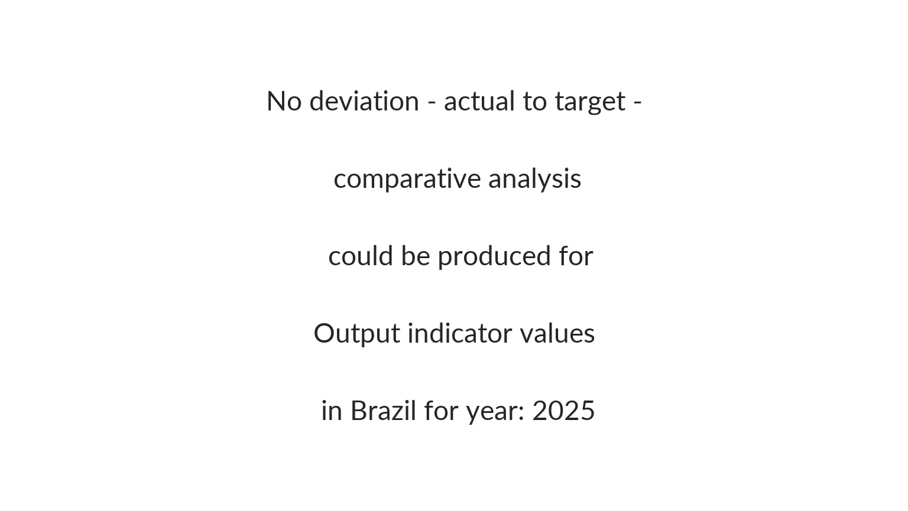

``` r
show_indicators_time(year =  2020, 
             ctr_name = "Brazil",
              result_type_name = "Output",
             type = "progress"
             )
```

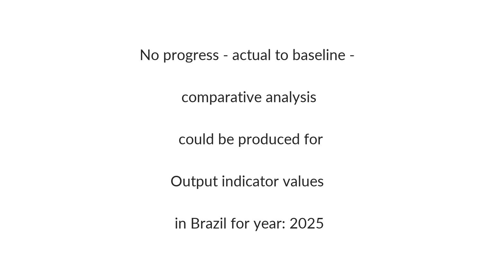

## Using `iati::dataSector`

### show_sectors

- What are the **most funded sectors** per country (Expenditure
  evolution per impact /outcome area)?

``` r
knitr::kable( iati::dataSector |> 
                dplyr::select( sector_vocabulary_name, sector_vocabulary_description) |>
                dplyr::distinct() |>
                dplyr::filter(!(is.na(sector_vocabulary_name))))
```

| sector_vocabulary_name | sector_vocabulary_description |
|:---|:---|
| Reporting Organisation | The sector reported corresponds to a sector vocabulary maintained by the reporting organisation for this activity |
| OECD DAC CRS Purpose Codes (5 digit) | The sector reported corresponds to an OECD DAC CRS 5-digit purpose code |
| Humanitarian Global Clusters (Inter-Agency Standing Committee) | The sector reported corresponds to an Inter-Agency Standard Committee Humanitarian Global Cluster code |
| Reporting Organisation 2 | The sector reported corresponds to a sector vocabulary maintained by the reporting organisation for this activity (if they are referencing more than one) |

``` r
show_sectors(
  year =  c(2020, 2021, 2022), 
  ctr_name = "Brazil",
  sector_vocabulary_name = "Reporting Organisation")
```

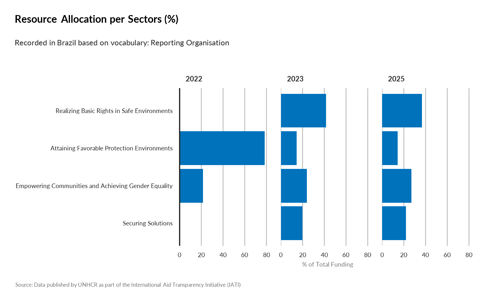

``` r
show_sectors(
  year = 2022, 
  ctr_name = "Brazil",
  sector_vocabulary_name = "Reporting Organisation 2")
```

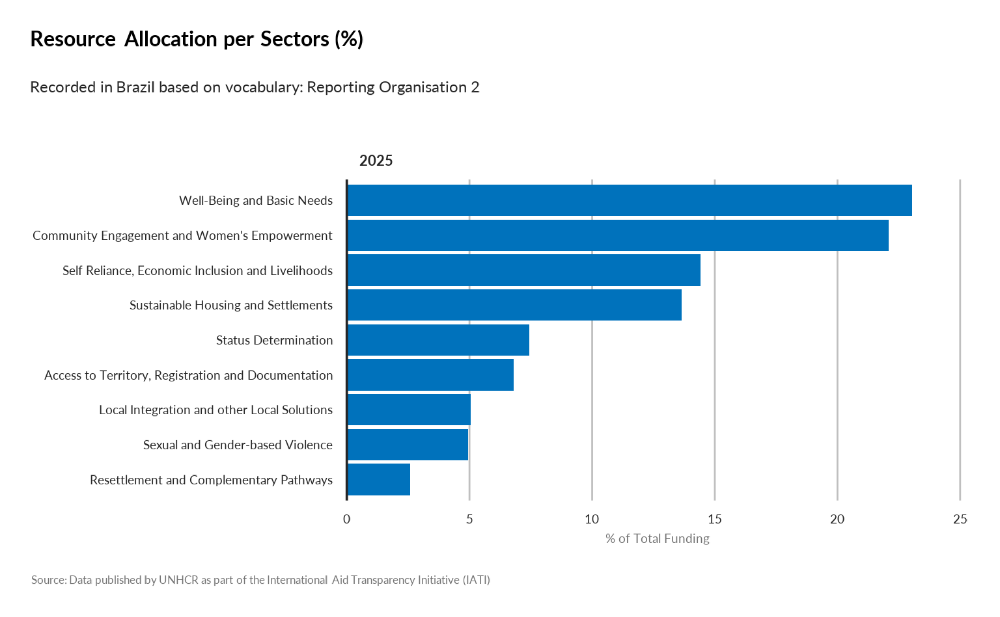

``` r
show_sectors(
  year = c(2020, 2021, 2022),  
  ctr_name = "Brazil",
  sector_vocabulary_name = "Reporting Organisation 2")
```


``` r
show_sectors(
  year = c(2017,2018,2019,2020,2021, 2022), 
  ctr_name = "Brazil",
  sector_vocabulary_name = "Humanitarian Global Clusters (Inter-Agency Standing Committee)")
```

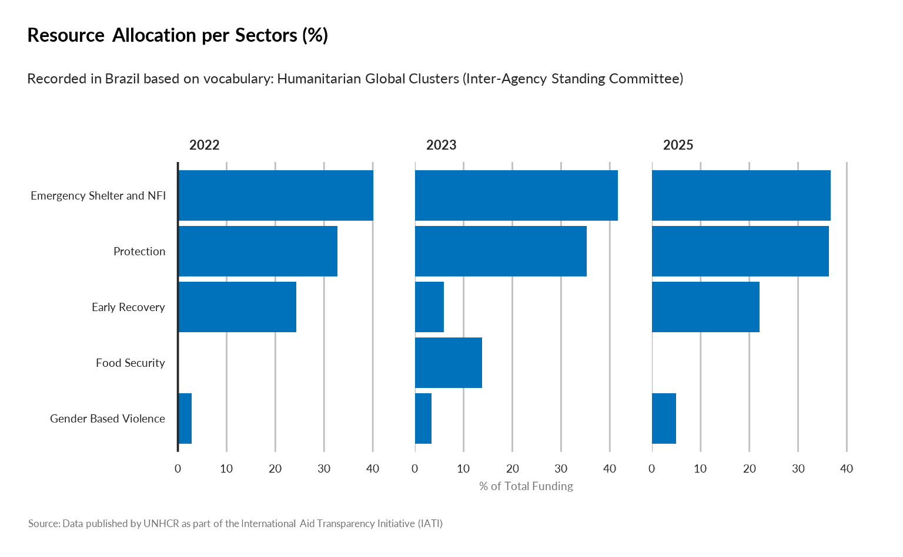

``` r
show_sectors(
  year = c(2017,2018,2019,2020,2021, 2022), 
  ctr_name = "Brazil",
  sector_vocabulary_name = "OECD DAC CRS Purpose Codes (5 digit)")
```

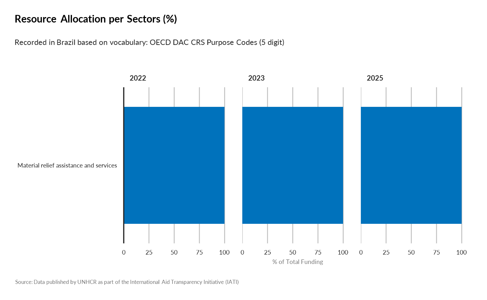

### show_goal_sdg

``` r
show_goal_sdg(year =  c(  2020, 2021, 2022), 
             ctr_name = "Brazil")
```


### show_outcome_rbm

``` r
show_outcome_rbm( year =  c(  2020, 2021, 2022), 
             ctr_name = "Brazil")
```


### show_outcome_result

``` r
show_outcome_result(year =  c(  2020, 2021, 2022), 
             ctr_name = "Brazil",
             outcome = "OA2: Status Determination")
```


``` r
show_outcome_result(year =  c(  2020, 2021, 2022), 
             ctr_name = "Brazil",
             outcome = "OA9: Sustainable Housing and Settlements")
```


``` r
show_outcome_result(year =  c(  2020, 2021, 2022), 
             ctr_name = "Brazil",
             outcome = "OA8: Well-Being and Basic Needs")
```


``` r
show_outcome_result(year =  c(  2020, 2021, 2022), 
             ctr_name = "Brazil",
             outcome = "OA4: Sexual and Gender-based Violence")
```


### compare_resource_result

``` r
# See a list of indicators per area of work
list_indic <- iati::mapping_indicator |> 
                 janitor::clean_names() |>
                 dplyr::filter( results_level =="Outcome") |>
                 dplyr::left_join(iati::mapping_result |> 
                                    dplyr::select(sector_rbm, area_id) |>
                                    dplyr::distinct(), by = c("area_id")) |>
                 dplyr::select(area_id, sector_rbm, indicator)
knitr::kable(list_indic)  
```

| area_id | sector_rbm | indicator |
|:---|:---|:---|
| OA1 | OA1: Access to Territory, Reg. and Documentation | 1.1 Proportion of refugees and asylum seekers registered on an individual basis. |
| OA1 | OA1: Access to Territory, Reg. and Documentation | 1.2 Proportion of children under 5 years of age whose births have been registered with a civil authority. \[SDG 16.9.1 - Tier 1\] |
| OA1 | OA1: Access to Territory, Reg. and Documentation | 1.3 Proportion of PoC with legally recognized identity documents or credentials \[GCR 4.2.2\]. |
| OA2 | OA2: Status Determination | 2.1 Average processing time (in days) from registration to first instance asylum decision (disaggregated by individual and group procedures). |
| OA2 | OA2: Status Determination | 2.2 Proportion of individuals undergoing asylum procedures who have access to legal advice or representation. |
| OA2 | OA2: Status Determination | 2.3 Proportion of individuals undergoing asylum procedures who have access to an effective appeal mechanism after first instance rejection of their claim. |
| OA3 | OA3: Protection Policy and Law | 3.1 Extent national legal framework is in line with the 1951 Convention and/or its 1967 Protocol. |
| OA3 | OA3: Protection Policy and Law | 3.2 Extent national legal framework is in line with the 1961 Convention on the Reduction of Statelessness. |
| OA4 | OA4: Sexual and Gender-based Violence | 4.1 Proportion of PoC who know where to access available GBV services |
| OA4 | OA4: Sexual and Gender-based Violence | 4.2 Proportion of POCs who do not accept violence against women. |
| OA4 | OA4: Sexual and Gender-based Violence | 4.3 Proportion of survivors who are satisfied with SGBV case management services. |
| OA5 | OA5: Child Protection | 5.1 Proportion of children at heightened risk who are supported by a Best Interests Procedure. |
| OA5 | OA5: Child Protection | 5.2 Proportion of children who participate in community-based child protection programmes |
| OA5 | OA5: Child Protection | 5.3 Proportion of unaccompanied and separated children who are in an appropriate alternative care arrangement |
| OA6 | OA6: Safety and Access to Justice | 6.1 Number of PoC arrested or detained related to immigration control or legal status |
| OA7 | OA7: Community Engagement and Women’s Empowerment | 7.1 Proportion of PoC who participate meaningfully across all phases of the OMC. |
| OA7 | OA7: Community Engagement and Women’s Empowerment | 7.2 Proportion of PoC who have access to effective feedback and response mechanisms. |
| OA7 | OA7: Community Engagement and Women’s Empowerment | 7.3 Proportion (and number) of active female participants on leadership/management structures. |
| OA8 | OA8: Well-Being and Basic Needs | 8.1 Proportion of PoC in need that receive cash transfers or in-kind assistance. |
| OA8 | OA8: Well-Being and Basic Needs | 8.2 Proportion of PoC with primary reliance on clean (cooking) fuels and technology \[SDG 7.1.2 Tier 1\] |
| OA9 | OA9: Sustainable Housing and Settlements | 9.1 Proportion of PoCs living in habitable and affordable housing. |
| OA9 | OA9: Sustainable Housing and Settlements | 9.2 Proportion of PoC that have energy to ensure lighting (close to Sphere). |
| OA10 | OA10: Healthy Lives | 10.1 Proportion of children aged 9 months to five years who have received measles vaccination. |
| OA10 | OA10: Healthy Lives | 10.2. Proportion of births attended by skilled health personnel. \[SDG 3.1.2 Tier 1\] |
| OA11 | OA11: Education | 11.1 Proportion of PoC enrolled in tertiary and higher education. |
| OA11 | OA11: Education | 11.2 Proportion of PoC enrolled in the national education system. \[GCR 2.2.1\] |
| OA12 | OA12: Clean Water, Sanitation and Hygiene | 12.1 Proportion of PoC using at least basic drinking water services \[linked to SDG 6.1.1\]. |
| OA12 | OA12: Clean Water, Sanitation and Hygiene | 12.2 Proportion of PoC with access to a safe household toilet \[linked to SDG 6.2.1\]. |
| OA13 | OA13: Self Reliance, Economic Inclusion and Livelihoods | 13.1. Proportion of PoC with an account at a bank or other financial institution or with a mobile-money-service provider \[SDG 8.10.2 Tier 1\]. |
| OA13 | OA13: Self Reliance, Economic Inclusion and Livelihoods | 13.2. Proportion of PoC who self-report positive changes in their income compared to previous year. |
| OA13 | OA13: Self Reliance, Economic Inclusion and Livelihoods | 13.3 Proportion of PoC (working age) who are unemployed. |
| OA14 | OA14: Voluntary Repatriation and Sustainable Reintegration | 14.1 Proportion of returnees with legally recognized identity documents or credentials \[GCR 4.2.2\]. |

``` r

compare_resource_result(year =   2022, 
                        show_baseline = TRUE,
                        show_target = TRUE,
      indicator = "13.2. Proportion of PoC who self-report positive changes in their income compared to previous year.",
      outcome = "OA8: Well-Being and Basic Needs")
```


``` r

compare_resource_result(year =   2022, 
       ctr_name = "Costa Rica",
       indicator = "13.2. Proportion of PoC who self-report positive changes in their income compared to previous year.",
       outcome = "OA8: Well-Being and Basic Needs")
```


``` r


compare_resource_result(year =   2022, 
       pop_type = "Refugees and Asylum-seekers",
       indicator = "13.2. Proportion of PoC who self-report positive changes in their income compared to previous year.",
       outcome = "OA8: Well-Being and Basic Needs")
```


## Using `iati::dataBudget`

### show_expenditure

- How much **expenditures compare to the initial budget** (potentially
  weighted by \# )?

``` r
show_expenditure(year = c(2018, 2019,2020, 2021, 2022, 2023), 
             ctr_name = "Brazil")
```


``` r

show_expenditure(year = c(2018, 2019,2020, 2021, 2022, 2023), 
             ctr_name = "Brazil",
             weight_by = c("refugees", "oip"))
```


``` r


show_expenditure(year = c(2018, 2019,2020, 2021, 2022, 2023),
             ctr_name = "Argentina",
             weight_by =  "all" )
```


### show_budget_gap

``` r
show_budget_gap(year = c(2018, 2019,2020, 2021, 2022, 2023), 
             ctr_name = "Brazil")
```


``` r
show_budget_gap(year = c(2018, 2019,2020, 2021, 2022, 2023), 
             ctr_name = "Brazil",
             weight_by = c("refugees", "oip"))
```


## Using `iati::dataTransaction`

### Show donors

- Who are the **main donors by country** in terms of transaction?

``` r
knitr::kable(iati::dataTransaction |>
                dplyr::select( transaction_type_name, transaction_type_description) |>
                dplyr::distinct() )
```

| transaction_type_name | transaction_type_description |
|:---|:---|
| Incoming Commitment | A firm, written obligation from a donor or provider to provide a specified amount of funds, under particular terms and conditions, reported by a recipient for this activity. |
| Expenditure | Outgoing funds that are spent on goods and services for the activity. |
| Disbursement | Outgoing funds that are placed at the disposal of a recipient government or organisation, or funds transferred between two separately reported activities. |

``` r
show_donors(year = 2022,
           programme_lab = "The Americas",
           transaction_type_name = "Incoming Commitment" )
```


``` r
show_donors(year = c(2018, 2019,2020, 2021, 2022, 2023),
           ctr_name = "Brazil",
           transaction_type_name = "Incoming Commitment" )
```


``` r
show_donors(year = c(2018, 2019,2020, 2021, 2022, 2023),
           programme_lab = "Brazil",
           transaction_type_name = "Disbursement" )
```


``` r
show_donors(year = c(2018, 2019,2020, 2021, 2022, 2023),
           programme_lab = "Brazil",
           transaction_type_name = "Expenditure" )
```


### show_top_donors

``` r
show_top_donors(year = 2022,
           ctr_name = "Brazil", 
           top_n = 5)
```


``` r
show_top_donors(year = 2020,
           ctr_name = "Brazil", 
           top_n = 10)
```


### show_earmarking

- What’s the breakdown of **Earmarking Type** (Un-earmarked, Tightly
  earmarked, etc.) from Donor Funds by Year?

``` r
knitr::kable(iati::dataTransaction |>
                dplyr::select(earmarking_name, earmarking_description)  |>
                dplyr::distinct() |>
                dplyr::filter(!(is.na(earmarking_name))))
```

| earmarking_name   | earmarking_description                                |
|:------------------|:------------------------------------------------------|
| Unearmarked       | Any or all of the Earmarking Modality codes A,B or C. |
| Softly Earmarked  | Any or all of the Earmarking Modality codes D,E or F. |
| Tightly Earmarked | Any or all of the Earmarking Modality codes I,J or K. |
| Earmarked         | Any or all of the Earmarking Modality codes G or H.   |

``` r
show_earmarking(year = c(2018, 2019,2020, 2021, 2022, 2023),  
             ctr_name = "Brazil")
```


### show_contributions

``` r
knitr::kable(iati::dataTransaction |>
                dplyr::select(aid_type1_name, aid_type1_description)  |>
                dplyr::distinct() |>
                dplyr::filter(!(is.na(aid_type1_name))))
```

| aid_type1_name | aid_type1_description |
|:---|:---|
| Core contributions to multilateral institutions | These funds are classified as multilateral ODA (all other categories fall under bilateral ODA). The recipient multilateral institution pools contributions so that they lose their identity and become an integral part of its financial assets. See Annex 2 of the DAC Directives for a comprehensive list of agencies core contributions to which may be reported under B02 (Section I. Multilateral institutions). |
| Contributions to specific-purpose programmes and funds managed by implementing partners | In addition to their core-funded operations, international organisations, NGOs, PPPs and networks, both in provider and in third countries, set up programmes and funds with a specific sectoral, thematic or geographical focus. Donors’ bilateral contributions to such programmes and funds are recorded here. |
| Project-type interventions | A project is a set of inputs, activities and outputs, agreed with the partner country*, to reach specific objectives/outcomes within a defined time frame, with a defined budget and a defined geographical area. Projects can vary significantly in terms of objectives, complexity, amounts involved and duration. There are smaller projects that might involve modest financial resources and last only a few months, whereas large projects might involve more significant amounts, entail successive phases and last for many years. A large project with a number of different components is sometimes referred to as a programme, but should nevertheless be recorded here. Feasibility studies, appraisals and evaluations are included (whether designed as part of projects/programmes or dedicated funding arrangements). Academic studies, research and development, trainings, scholarships, and other technical assistance activities not directly linked to development projects/programmes should instead be recorded under D02. Aid channelled through NGOs or multilaterals is also recorded here. This includes payments for NGOs and multilaterals to implement donors’ projects and programmes, and funding of specified NGOs projects. By contrast, core funding of NGOs and multilaterals as well as contributions to specific-purpose funds are recorded under B.* In the cases of equity investments, humanitarian aid or aid channelled through NGOs, projects are recorded here even if there was no direct agreement between the donor and the partner country. |

``` r
show_contributions(year = c(2018, 2019,2020, 2021, 2022, 2023), 
                   ctr_name = "Brazil") 
```


``` r
show_contributions(year = c(2018, 2019,2020, 2021, 2022, 2023), 
                   programme_lab = "The Americas") 
```


### show_transaction_flow

``` r
show_transaction_flow(year = c(2020, 2021, 2022, 2023), 
                   ctr_name = "Brazil")
```


``` r

show_transaction_flow(year = 2023, 
                   ctr_name = "Brazil")
```


## Using `iati::dataParticipating_org`

### Show partnership

- How **organisations partner together**?

``` r
show_partnership(year = 2022,
           ctr_name = "Brazil" ) 
```

| Organisation | Funding | Implementing |
|:---|:---|:---|
| Government | Governmental donors of unearmarked and flexible funds, United States , Government of Cyprus , Government of Brazil |  |
| National NGO | Australia for UNHCR , España con ACNUR (Spain) , Fundación ACNUR Comité Argentino (Argentina), Japan for UNHCR , Sweden for UNHCR , Switzerland for UNHCR , UK for UNHCR , UNO-Flüchtlingshilfe (Germany) , USA for UNHCR |  |
| Other Public Sector | European Commission - Humanitarian Aid & Civil Protection, European Commission - International Partnerships |  |
| Multilateral | UN Women , International Organization for Migration (IOM) | United Nations High Commissioner for Refugees (UNHCR) |
| Partner Country based NGO |  | Caritas Brasileira Regional Parana , Instituto MANA , ASAV Servico Jesuita a Migrantes e Refugiados , CARITAS ARQUIDIOCESANA DE MANAUS , Associacao Hermanitos , Pia Sociedade dos Missionários de São Carlos , Associacao Voluntarios Para o Servicio Internacional - BRASIL, CARITAS ARQUIDIOCESANA DE SAO PAULO, BRAZIL , INSTITUTO DE MIGRACOES E DIREITOS HUMANOS , I Know My Rights , CARITAS ARQUIDIOCESANA DE RIO DE JANEIRO, BRAZIL , A Casa - Museu De Artes e Artefatos Brasileiros , Associacao Compassiva , Instituto Internacional de Educacao do Brasil , Organizacao Fraternidade sem Fronteiras , Aldeias Infantis SOS Brasil |
| International NGO |  | ADVENTIST DEVELOPMENT AND RELIEF AGENCY, Panamerican Development Foundation |
| Private Sector | Private donors |  |

## Template

### template_prez

``` r

## generate for one country
# iati::template_prez(year = 2022, 
#                     ctr_name = "Brazil",
#                     folder = "dev/Prez")

# ## Generate for all operation specific region
# reg <- iati::dataActivity |>
#   dplyr::select( unhcr_region) |>
#   dplyr::filter(! is.na(unhcr_region)) |>
#   dplyr::distinct() |>
#   dplyr::pull() 
# 
# thisfolder <- "dev/SMR" 
# 
# for (region in reg) { 
#       cat(paste0( region,   "\n"))
#
#       # region <- "The Americas"   
#       countries <- iati::dataActivity |>
#         dplyr::filter( unhcr_region ==  region) |>
#         dplyr::select(ctr_name) |>
#         dplyr::distinct() |>
#         dplyr::pull() 
#       
#       for ( ctr in countries) {
#         cat(paste0("Generating for ", ctr, "\n"))
#         iati::template_prez(year = 2022,
#                             ctr_name = ctr,
#                             folder =  thisfolder)  
#         }
#     }
```

### template_compare

``` r
# iati::template_compare(year = 2022, folder = "dev/Result")
```
